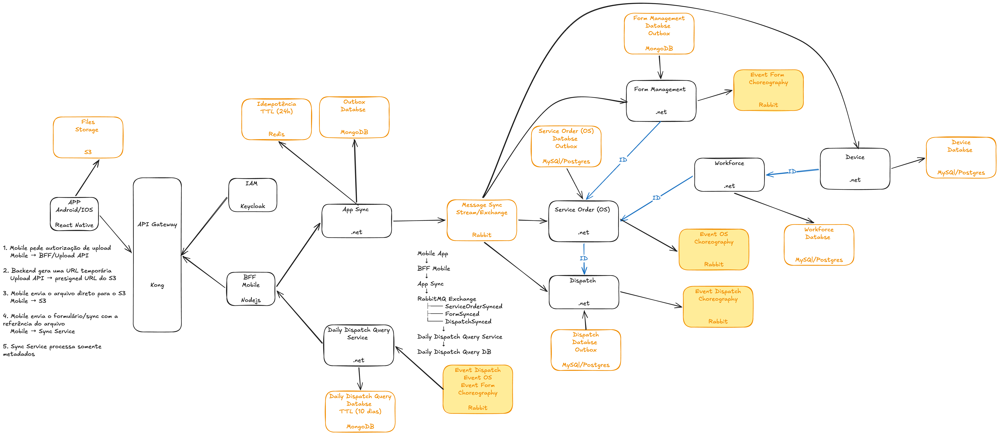

# Arquitetural de Plataforma SaaS Offline First

## Classificação dos Domínios

## Classificação dos Domínios

| Categoria  | Domínio                              | Descrição                                                                                                                                      | Objetivo Estratégico                                                                             |
|------------|--------------------------------------|------------------------------------------------------------------------------------------------------------------------------------------------|--------------------------------------------------------------------------------------------------|
| Core       | Service Order (OS)                   | Representa a ordem de serviço e seu ciclo de vida operacional, incluindo abertura, execução, atualização de status, prioridade e encerramento. | Garantir consistência e confiabilidade no principal fluxo de valor da plataforma.                |
| Core       | Planning / Dispatch                  | Representa o planejamento operacional das ordens de serviço, incluindo distribuição, agenda, roteirização e priorização do trabalho em campo.  | Otimizar a operação e aumentar a eficiência do atendimento.                                      |
| Supporting | Form Management                      | Modela formulários dinâmicos, sua estrutura, regras de preenchimento e respostas coletadas durante a execução das ordens de serviço.           | Permitir adaptação do produto a diferentes processos e verticais de negócio.                     |
| Supporting | Tenant                               | Representa a organização cliente da plataforma, seus parâmetros de negócio e o limite organizacional de operação.                              | Garantir segregação organizacional e clareza de responsabilidade por cliente.                    |
| Supporting | Workforce                            | Representa usuários operacionais, equipes, supervisores e seus vínculos com a execução do trabalho em campo.                                   | Dar suporte à operação diária e à organização do trabalho.                                       |
| Supporting | Profile & Group Access               | Define perfis, grupos e permissões funcionais associadas aos papéis de negócio.                                                                | Assegurar controle de acesso aderente às responsabilidades operacionais.                         |
| Supporting | Device                               | Representa os dispositivos utilizados na operação quando houver regras de negócio relevantes sobre vínculo, posse ou uso do equipamento.       | Sustentar rastreabilidade operacional do uso de dispositivos quando isso fizer parte do domínio. |
| Generic    | Identity & Access Management (IAM)   | Responsável pela identidade técnica, autenticação e sessão, sem carregar regras específicas do negócio operacional.                            | Garantir segurança, padronização e independência da camada de identidade.                        |

## Modelo de Cardinalidade

| Relação                                  | Cardinalidade | Descrição                                                                                                  |
|------------------------------------------|---------------|------------------------------------------------------------------------------------------------------------|
| Tenant → Workforce                       | 1:N           | Um tenant pode possuir vários usuários e equipes associados à sua estrutura organizacional.                |
| Workforce ↔ IAM                          | 1:1           | Cada usuário operacional está associado a uma identidade técnica única para autenticação e acesso.         |
| Workforce → Profile & Group Access       | N:1           | Vários usuários podem compartilhar o mesmo perfil ou grupo de acesso conforme sua função no negócio.       |
| Workforce → Device                       | 1:N           | Um usuário pode ter mais de um dispositivo vinculado ao longo do tempo, conforme seu contexto de atuação.  |
| Workforce → Service Order (OS)           | N:1           | Vários usuários podem participar da mesma ordem de serviço, conforme a composição operacional da execução. |
| Service Order (OS) → Planning / Dispatch | N:1           | Várias ordens de serviço podem pertencer ao mesmo planejamento operacional.                                |
| Form Management → Service Order (OS)     | N:1           | Vários formulários podem estar associados à mesma ordem de serviço.                                        |

## Bounded Context

```text
                     +------------------+     +-----------------------------+
                     |       IAM        |<----|  Profile & Group Access     |
                     |------------------| N:1 |-----------------------------|
                     | IAM Context      |     | Access Context              |
                     | Auth / Identity  |     | Perfil / Grupo / Permissão  |
                     +------------------+     +-----------------------------+
                              \
                               \
                                |
                                v
+----------------------+      +----------------------+      +------------------+
|        Tenant        | 1:N  |      Workforce       | 1:1  |      Device      |
|----------------------|----->|----------------------|<-----|------------------|
| Tenant Context       |      | Workforce Context    |      | Device Context   |
| Cliente / Regras     |      | Usuário / Equipe     |      | Dispositivo      |
+----------------------+      +----------------------+      +------------------+
                                         |
                                         | N:1
                                         v
                              +----------------------------------+
                              |      Service Order (OS)          |
                              |----------------------------------|
                              | Service Order Context            |
                              | Ordem de Serviço / Execução      |
                              +----------------------------------+
                                   ^                      |
                                   | N:1                  | N:1
                                   |                      v
                     +-----------------------------+   +--------------------------+
                     |     Form Management         |   |  Planning / Dispatch     |
                     |-----------------------------|   |--------------------------|
                     | Form Context                |   | Planning Context         |
                     | Template / Resposta         |   | Plano / Rota             |
                     +-----------------------------+   +--------------------------+
```

## Design Solution

## Mobile


## Regras básicas

| Regra                              | Onde aplicar                                                    | Diretriz da solução                                                                                                       | Benefício                                       |
| ---------------------------------- |-----------------------------------------------------------------|---------------------------------------------------------------------------------------------------------------------------| ----------------------------------------------- |
| **Retry com backoff**              | Consumo de eventos, chamadas externas, processamento assíncrono | Toda falha transitória deve ser retentada com intervalo progressivo e limite máximo de 3 tentativas.                      | Evita falhas por instabilidade momentânea.      |
| **DLQ**                            | Filas, eventos e integrações assíncronas                        | Mensagens que excederem o limite de retry devem ir para uma fila de erro com motivo da falha e dados para reprocessamento. | Evita perda silenciosa e facilita recuperação.  |
| **Circuit Breaker**                | Chamadas síncronas entre serviços e provedores externos         | Se um serviço dependente falhar repetidamente, novas chamadas devem ser interrompidas temporariamente.                    | Evita efeito cascata.                           |
| **Timeout**                        | Toda chamada síncrona                                           | Nenhuma chamada entre serviços pode ficar sem timeout explícito.                                                          | Evita consumo indefinido de recursos.           |
| **Bulkhead**                       | BFF, Sync Service, Query Services, integrações                  | Separar pools, filas ou limites por tipo de carga/cliente/rota crítica.                                                   | Isola falhas e protege fluxos críticos.         |
| **Idempotência**                   | Sync                                                            | Toda operação mutável deve aceitar uma chave idempotente ou identificador de evento.                                      | Evita duplicidade em retries e redes instáveis. |
| **Outbox Pattern**                 | Serviços donos de escrita                                       | Toda mudança de estado que gere evento deve gravar dado de negócio e evento na mesma transação.                           | Garante consistência entre banco e eventos.     |
| **Optimistic Concurrency**         | Todos updates offline                                           | Entidades alteradas offline devem possuir versão, revisão ou timestamp lógico.                                            | Evita sobrescrita silenciosa.                   |
| **Rate Limit / Throttling**        | BFF, Sync API, APIs públicas                                    | Limitar volume por tenant, usuário, device e rota.                                                                        | Protege contra picos, bugs e abuso.             |
| **Feature Flags**                  | Migração, novos fluxos, rollout por tenant                      | Novas capacidades devem poder ser ativadas/desativadas por tenant ou grupo.                                               | Permite rollout seguro.                         |
| **Observabilidade correlacionada** | Todos os serviços                                               | Propagar `trace_id`, `correlation_id`, `tenant_id`, `user_id`, `device_id`, `service_order_id`.                           | Facilita troubleshooting ponta a ponta.         |
| **Versionamento de contratos**     | APIs, eventos, mobile                                           | APIs e eventos devem ser versionados desde o início.                                                                      | Evita quebra de consumidores.                   |
| **Read Model Rebuild**             | CQRS/query services                                             | Toda projeção de leitura deve poder ser reconstruída a partir da fonte confiável.                                         | Reduz risco de inconsistência no read side.     |
| **Tenant Isolation**               | Todos os domínios                                               | Toda escrita, leitura, evento e log deve carregar `tenant_id`.                                                            | Garante segurança multi-tenant.                 |
| **Strangler Pattern**              | Modernização do legado                                          | Extrair contextos gradualmente, sem big bang.                                                                             | Reduz risco de migração.                        |

## Ganhos com API Gateway

| Problema atual                              | Capacidade do API Gateway                                 | Ganho esperado                                                |
| ------------------------------------------- | --------------------------------------------------------- | ------------------------------------------------------------- |
| Ausência de ponto central de entrada        | Roteamento centralizado por domínio/serviço               | Reduz exposição direta dos serviços internos                  |
| Falta de rate limiting                      | Rate limit por tenant, usuário, IP, rota ou client        | Protege contra abuso, bugs no app e picos de carga            |
| Falta de throttling                         | Controle de concorrência e limitação por endpoint crítico | Evita sobrecarga no Sync, Query Services e APIs transacionais |
| AuthN/AuthZ espalhado                       | Validação centralizada de token/JWT e claims              | Padroniza segurança e reduz duplicidade nos serviços          |
| Sem versionamento claro de APIs             | Roteamento por versão (`/v1`, `/v2`)                      | Permite evolução sem quebrar mobile/web                       |
| Baixa observabilidade na entrada            | Logs, métricas e tracing na borda                         | Facilita diagnóstico de latência, erro e consumo por tenant   |
| Picos do mobile afetando backend            | Políticas específicas para `/sync`, `/query`, `/admin`    | Isola cargas diferentes e reduz efeito cascata                |
| Falta de proteção contra tráfego malformado | Validação básica de payload, headers e tamanho de request | Bloqueia requests inválidos antes de chegar aos serviços      |
| Dificuldade em controlar clientes antigos   | Políticas por app version, client_id ou canal             | Permite bloquear, limitar ou migrar versões gradualmente      |
| Exposição inconsistente de APIs             | Contratos e rotas padronizadas                            | Melhora governança e reduz acoplamento                        |
| Risco de chamadas caras sem controle        | Quotas por tenant/plano                                   | Permite governança comercial e técnica do uso                 |
| Deploy arriscado de novas rotas             | Canary, blue/green e traffic splitting                    | Permite rollout progressivo com rollback seguro               |
| Falta de camada uniforme para BFFs          | Entrada padronizada para Mobile BFF e Web BFF             | Simplifica segurança, roteamento e observabilidade            |

## Redução mensurável de custo por transação
Custo por transação = custo total de cloud / volume de transações

### Situação atual (AS-IS)

| Problema                     | Impacto                         |
| ---------------------------- | ------------------------------- |
| MySQL único                  | custo alto fixo + gargalo       |
| Lambdas excessivas           | custo variável alto + conexões  |
| Relatórios no mesmo DB       | uso ineficiente de recurso caro |
| Sem cache                    | leitura repetitiva              |
| Sync pesado                  | CPU/memória elevados            |
| Falta de controle de entrada | desperdício por picos           |

### Como a arquitetura resolve
| Componente                | Redução de custo           |
| ------------------------- | -------------------------- |
| **CQRS / Query Service**  | tira leitura do banco caro |
| **Mongo/Read DB**         | custo menor por leitura    |
| **Redis cache**           | reduz chamadas ao DB       |
| **RabbitMQ (assíncrono)** | evita overprovisioning     |
| **API Gateway**           | evita tráfego inútil       |
| **App Sync otimizado**    | reduz carga desnecessária  |
| **S3 direto (upload)**    | tira CPU do backend        |
| **Serviços por domínio**  | escala apenas o necessário |

### Meta

| Métrica             | Antes         | Depois          |
| ------------------- | ------------- | --------------- |
| Custo por transação | 100% baseline | **-30% a -50%** |
| Capacidade (TPS)    | 450           | **1350+**       |
| Eficiência          | baixa         | alta            |

## Ambientes Dev / Staging / Prod

| Ambiente    | Função          | Características            |
| ----------- | --------------- | -------------------------- |
| **Dev**     | desenvolvimento | rápido, barato, dados mock |
| **Staging** | validação       | semelhante à produção      |
| **Prod**    | operação real   | alta disponibilidade       |

Como será implementado

| Item            | Estratégia                        |
| --------------- | --------------------------------- |
| Infraestrutura  | Terraform com ambientes separados |
| Banco           | instâncias isoladas               |
| Secrets         | separados por ambiente            |
| Deploy          | pipelines independentes           |
| Observabilidade | segregada                         |
| Feature flags   | controladas por ambiente          |

## Desenvolvimento com IA
Acelerar entrega mantendo qualidade, consistência arquitetural e controle técnico, usando IA como copiloto, não como “autoridade”.

| Etapa                          | Ferramenta                       | Papel na solução                                                                                        |
| ------------------------------ | -------------------------------- | ------------------------------------------------------------------------------------------------------- |
| **Desenvolvimento**            | **Cursor**                       | Geração de código, refactor, testes e aplicação das regras arquiteturais do projeto                     |
| **Code Review**                | **Copilot PR / CodeRabbit**      | Revisão automática de PRs (performance, segurança, padrões, cobertura de testes) antes do review humano |
| **Arquitetura / Análise**      | **Claude / GPT**                 | Análise de legado, definição de boundaries, apoio a decisões de design e refactor                       |
| **CI/CD**                      | **GitHub Actions + AI insights** | Análise de falhas de pipeline, identificação de gaps de testes e sugestões de melhoria                  |
| **Observabilidade / Operação** | **Grafana / Datadog AI**         | Análise de incidentes, correlação de logs/traces e sugestão de causa raiz                               |
| **Segurança**                  | **Snyk / Semgrep + IA**          | Detecção de vulnerabilidades, análise de dependências e recomendações de correção                       |


### Exemplo rules cursor
```text
.cursor/
  rules/
    architecture.mdc
    ddd-bounded-contexts.mdc
    performance.mdc
    testing.mdc
    observability.mdc
    security.mdc
    event-driven.mdc
    database.mdc
```
CODEOWNERS para proteger os padrões definidos

```text
.cursor/rules/* @platform-team @architecture-board
.github/workflows/* @platform-team
terraform/* @platform-team
deploy/* @platform-team
```

Assim qualquer alteração nas rules exige aprovação dos donos.

# Observabilidade da Plataforma

## Correlation
trace_id
correlation_id
event_id
tenant_id
user_id
device_id
service_order_id

## Golden Signals

Aplicar em todos os serviços:

| Sinal          | O que mede            | Exemplo no seu sistema             |
| -------------- | --------------------- | ---------------------------------- |
| **Latency**    | tempo de resposta     | tempo do `/sync`, `/query/workday` |
| **Traffic**    | volume de requisições | requests por segundo por endpoint  |
| **Errors**     | taxa de erro          | % de sync falhando, eventos DLQ    |
| **Saturation** | uso de recurso        | CPU, memória, conexões DB, fila    |

## SLI por domínio
1. App Sync

   | SLI                       | Descrição                         |
   | ------------------------- | --------------------------------- |
   | Sync Success Rate         | % de requests aceitos com sucesso |
   | Sync Latency              | tempo de ingestão                 |
   | Idempotency Conflict Rate | conflitos detectados              |
   | Queue Publish Success     | sucesso ao publicar eventos       |

2. Service Order

   | SLI                    | Descrição                 |
   | ---------------------- | ------------------------- |
   | OS Update Success Rate | sucesso na atualização    |
   | Conflict Rate          | conflitos de concorrência |
   | Processing Latency     | tempo de processamento    |
   | Event Publish Latency  | tempo até emitir evento   |

3. Form Management

   | SLI                          | Descrição             |
   | ---------------------------- | --------------------- |
   | Form Submission Success      | sucesso no envio      |
   | Attachment Validation Errors | falhas de validação   |
   | Processing Time              | tempo de persistência |
   | Event Emission Rate          | eventos gerados       |

4. Dispatch / Planning

   | SLI                     | Descrição                    |
   | ----------------------- | ---------------------------- |
   | Dispatch Update Success | sucesso nas alterações       |
   | Assignment Latency      | tempo para refletir mudanças |
   | Query Consistency Lag   | atraso na projeção           |

5. Query Service (Daily Dispatch)

   | SLI            | Descrição                   |
   | -------------- | --------------------------- |
   | Query Latency  | tempo de resposta           |
   | Projection Lag | atraso em relação ao evento |
   | Cache Hit Rate | eficiência de cache         |
   | Availability   | uptime do endpoint          |


6. RabbitMQ / Event Backbone

   | SLI             | Descrição           |
   | --------------- | ------------------- |
   | Queue Depth     | tamanho da fila     |
   | Consumer Lag    | atraso no consumo   |
   | DLQ Rate        | mensagens em erro   |
   | Publish Latency | tempo de publicação |

## SLO sugeridos

| Domínio / Componente                      | SLO                             | Meta     |
| ----------------------------------------- | ------------------------------- | -------- |
| **Plataforma Geral**                      | Disponibilidade                 | ≥ 99.9%  |
|                                           | Taxa de erro                    | < 1%     |
| **App Sync Service**                      | Sync Success Rate               | ≥ 99%    |
|                                           | Latência (P95)                  | < 500 ms |
| **Query Service (Mobile)**                | Latência (P95)                  | < 200 ms |
|                                           | Disponibilidade                 | ≥ 99.9%  |
| **Event Processing (Rabbit / Consumers)** | Event Lag (P95)                 | < 5s     |
|                                           | DLQ Rate                        | < 0.1%   |
| **Banco de Dados**                        | Uso de conexões                 | < 80%    |
|                                           | CPU média                       | < 70%    |
| **Service Order / Core Services**         | Success Rate                    | ≥ 99%    |
|                                           | Latência de processamento (P95) | < 300 ms |
| **Form Management**                       | Form Submission Success         | ≥ 99%    |
|                                           | Latência (P95)                  | < 300 ms |
| **Dispatch / Planning**                   | Update Success Rate             | ≥ 99%    |
|                                           | Latência de atualização (P95)   | < 300 ms |

# Stack de Observabilidade Recomendada

| Categoria          | Ferramenta                    | Descrição                                                                   |
| ------------------ | ----------------------------- |-----------------------------------------------------------------------------|
| **Instrumentação** | **OpenTelemetry (OTel)**      | Padrão de mercado para coleta de métricas, logs e traces de forma unificada |
|                    | SDK em todos os serviços      | Todos os serviços devem ser instrumentados nativamente                      |
| **Tracing**        | **Jaeger (self-hosted)**      | Rastreamento distribuído para análise de latência entre serviços            |
| **Métricas**       | **Prometheus**                | Coleta e armazenamento de métricas (latência, erro, throughput)             |
|                    | **Grafana**                   | Visualização e criação de dashboards                                        |
| **Logs**           | **Loki**                      | Armazenamento de logs estruturados com alta eficiência                      |
| **Alertas**        | **Alertmanager**              | Gerenciamento de alertas baseado em métricas e thresholds                   |

# CI/CD

| Área                | Ferramenta                  | Uso                                            |
| ------------------- | --------------------------- | ---------------------------------------------- |
| **CI/CD**           | GitHub Actions ou GitLab CI | Pipeline de build, teste, segurança e deploy   |
| **Container**       | Docker                      | Build padronizado dos serviços                 |
| **Registry**        | ECR                         | Armazenamento de imagens                       |
| **Deploy**          | Argo CD                     | GitOps para Kubernetes/ECS                     |
| **IaC**             | Terraform                   | Provisionamento de infraestrutura              |
| **SAST**            | SonarQube ou Semgrep        | Análise estática de código                     |
| **SCA**             | Dependabot / Snyk           | Vulnerabilidades em dependências               |
| **Secrets Scan**    | Gitleaks                    | Bloqueio de secrets no repositório             |
| **DAST**            | OWASP ZAP                   | Testes dinâmicos em ambiente de staging        |
| **Testes de carga** | k6                          | Testes de performance e regressão de latência  |
| **Contract Test**   | Pact                        | Garantia de contratos entre serviços           |
| **Quality Gate**    | SonarQube                   | Cobertura, duplicação, bugs e vulnerabilidades |

## Pipeline

```text
Pull Request
    ↓
Lint / Format
    ↓
Unit Tests
    ↓
SAST / SCA / Secret Scan
    ↓
Build Docker Image
    ↓
Contract Tests
    ↓
Deploy em ambiente Preview/Staging
    ↓
Integration Tests
    ↓
   DAST
    ↓
k6 Smoke/Performance Test
    ↓
Approval / Change Control
    ↓
Deploy Prod Canary
    ↓
Promote / Rollback
```

## Gates

| Gate               | Critério mínimo                          |
| ------------------ |------------------------------------------|
| **Unit tests**     | 100% pass                                |
| **Coverage**       | meta inicial ≥ 70%, evoluindo para ≥ 90% |
| **SAST**           | sem vulnerabilidade crítica/alta         |
| **SCA**            | sem dependência crítica conhecida        |
| **Secrets**        | zero secrets no código                   |
| **Contract tests** | 100% pass nos contratos publicados       |
| **DAST**           | sem vulnerabilidade crítica              |
| **k6 smoke**       | p95 dentro do SLO definido               |
| **Deploy**         | canary + rollback automático/manual      |

# Pirâmide de Testes

                 +----------------------+
                 |   E2E / Smoke Tests  |
                 |   poucos e críticos  |
                 +----------------------+
              +----------------------------+
              |   Contract / Integration   |
              |   APIs, eventos, DB, fila  |
              +----------------------------+
          +------------------------------------+
          |           Unit Tests               |
          |      domínio, regras, use cases    |
          +------------------------------------+

| Camada                | O que testar                                                         | Exemplos                                                              |
| --------------------- | -------------------------------------------------------------------- | --------------------------------------------------------------------- |
| **Unit Tests**        | Regras de domínio e casos de uso isolados                            | mudança de status da OS, validação de formulário, regra de perfil     |
| **Integration Tests** | Integração com banco, fila, storage e dependências reais controladas | salvar OS + outbox, consumir evento, gravar read model                |
| **Contract Tests**    | Contratos entre BFF, serviços e eventos                              | payload de `ServiceOrderSynced`, API `/workday`, schema de formulário |
| **E2E / Smoke Tests** | Jornada crítica mínima                                               | técnico baixa agenda, executa OS, envia formulário, consulta status   |
| **Performance Tests** | Latência e throughput por fluxo crítico                              | sync em pico, query do despacho diário, consumo de eventos            |


# Escalabilidade

## Sharding
O sharding não será adotado como primeira estratégia de escala. Antes disso, a solução prioriza separação por domínio, CQRS, read models, cache, otimização de queries e isolamento de workloads.

Ainda assim, todos os dados transacionais devem carregar tenant_id, permitindo evolução futura para particionamento ou sharding por tenant caso um domínio atinja limite real de escala.

| Decisão             | Diretriz                                                 |
| ------------------- | -------------------------------------------------------- |
| Sharding inicial    | Não aplicar                                              |
| Preparação          | Incluir `tenant_id` nos modelos, eventos, logs e queries |
| Chave candidata     | `tenant_id`                                              |
| Quando considerar   | Após evidência de saturação por domínio                  |
| Domínios candidatos | Service Order, Form Management, Query DB                 |

## Componentes

| Estratégia         | Diretriz                                             | Benefício                   |
| ------------------ | ---------------------------------------------------- | --------------------------- |
| Horizontal scaling | Escalar serviços por número de instâncias/pods       | Aumenta capacidade linear   |
| Stateless          | Serviços não mantêm estado em memória                | Permite auto scaling seguro |
| Autoscaling        | Baseado em CPU, memória, latência e fila             | Ajuste automático à demanda |
| Bulkhead           | Separar pools por tipo de carga (sync, query, admin) | Evita efeito cascata        |


# Plano Faseado com Execução Paralela

### Fase 1 — Stabilize & Control

**Período:** Mês 1–2

**Objetivo:**  
Reduzir instabilidade diária e criar controle operacional.

**Times envolvidos:**
- Platform & SRE
- Data/Backend
- Backend (suporte ao legado)

**Workstreams em paralelo:**
- Platform
- Data
- SRE

**Entregas principais:**
- API Gateway inicial
- Rate limit por tenant
- Logs correlacionados
- Tuning de queries
- Isolamento inicial de relatórios
- Primeira base de leitura

---

### Fase 2 — Engineering Foundation

**Período:** Mês 1–2

**Objetivo:**  
Preparar o time para mudar com segurança.

**Times envolvidos:**
- Platform & SRE
- DevEx

**Workstreams em paralelo:**
- Platform
- Governança
- DevEx

**Entregas principais:**
- CI/CD com gates
- Dev/Staging/Prod
- CODEOWNERS
- Cursor rules
- ADRs
- SAST/SCA
- Observabilidade base

---

### Fase 3 — Read Separation / CQRS

**Período:** Mês 3–6

**Objetivo:**  
Tirar leitura crítica do banco transacional.

**Times envolvidos:**
- Data/Backend
- Backend (domínios)
- Mobile
- BFF

**Workstreams em paralelo:**
- Data
- Backend
- Mobile/BFF

**Entregas principais:**
- Daily Dispatch Query Service
- Query DB com TTL
- Cache Redis
- Read models para app mobile

---

### Fase 4 — Sync Modernization

**Período:** Mês 4–8

**Objetivo:**  
Isolar carga mobile e preparar ingestão event-driven.

**Times envolvidos:**
- Mobile
- Backend (Sync)
- Platform

**Workstreams em paralelo:**
- Mobile
- Sync
- Platform

**Entregas principais:**
- App Sync Service
- Idempotência
- Upload direto S3
- RabbitMQ exchange
- Eventos `ServiceOrderSynced`
- Eventos `FormSynced`
- Eventos `DispatchSynced`

---

### Fase 5 — Domain Extraction / Strangler

**Período:** Mês 6–14

**Objetivo:**  
Extrair domínios sem big bang.

**Times envolvidos:**
- Backend (squads por domínio)
- Data
- Platform
- Arquitetura

**Workstreams em paralelo:**
- Core Domains
- Data
- Platform

**Entregas principais:**
- Service Order extraído gradualmente
- Form Management extraído gradualmente
- Planning / Dispatch extraído gradualmente
- Workforce extraído gradualmente
- Outbox / Inbox
- Banco/schema por domínio

---

### Fase 6 — Web Modernization / BFF

**Período:** Mês 6–16

**Objetivo:**  
Desacoplar frontend web legado.

**Times envolvidos:**
- Frontend
- Backend (BFF)
- Platform

**Workstreams em paralelo:**
- Frontend
- BFF
- Platform

**Entregas principais:**
- Web BFF
- Rotas migradas do ASP.NET MVC
- Novos fluxos em frontend moderno
- Feature flags por tenant

---

### Fase 7 — Scale, FinOps & Runtime Modernization

**Período:** Mês 10–18

**Objetivo:**  
Validar 3x tráfego e reduzir custo por transação.

**Times envolvidos:**
- SRE
- Platform
- Backend
- FinOps (quando aplicável)

**Workstreams em paralelo:**
- SRE
- Platform
- Backend

**Entregas principais:**
- Autoscaling
- Tuning RabbitMQ
- Padronização .NET LTS
- Consolidação de Lambdas
- Rightsizing
- Teste de carga 1350+ TPS

### Fase 8 — Consolidation & Decommissioning

**Período:** Mês 14–20

**Objetivo:**  
Consolidar a arquitetura alvo, remover dependências do legado e garantir operação sustentável de longo prazo.

**Times envolvidos:**
- Platform & SRE
- Backend (domínios)
- Frontend
- Arquitetura
- FinOps

**Workstreams em paralelo:**
- Platform
- Core Domains
- Frontend
- FinOps

**Entregas principais:**
- Desativação gradual do ASP.NET MVC legado
- Remoção de rotas não utilizadas
- Eliminação de acesso direto ao banco legado
- Consolidação dos BFFs (Mobile/Web)
- Padronização final dos contratos de API e eventos
- Revisão e limpeza de Lambdas obsoletas
- Consolidação de observabilidade (dashboards finais por domínio)
- Hardening de segurança (WAF rules, IAM, auditoria)
- Otimização final de custos (infra, storage, egress)
- Documentação final da arquitetura (ADR consolidado)

---

### Ganhos esperados

- Redução definitiva de complexidade operacional
- Eliminação de dívida técnica estrutural
- Redução adicional de custo (infra ociosa/duplicada)
- Melhora significativa de onboarding de novos devs
- Arquitetura consistente e sustentável

---

### Riscos e mitigação

| Risco | Mitigação |
|---|---|
| Remover algo ainda em uso | Observabilidade + logs + feature flags |
| Dependência oculta do legado | Shadow traffic + auditoria de acesso |
| Regressão em fluxos antigos | Canary + rollback |
| Complexidade de cleanup | Planejamento incremental por domínio |

---

### IA aplicada

- Identificar endpoints e serviços não utilizados
- Detectar código morto
- Sugerir simplificações de arquitetura
- Validar consistência entre contratos antigos e novos
- Apoiar documentação final e ADRs consolidados

---

### Esforço estimado

**16–24 pessoas-mês**

---

### Critérios de saída (DoD)

- Nenhum fluxo crítico depende do ASP.NET MVC legado
- Todos os domínios operando de forma independente
- BFFs como única entrada para frontend
- Observabilidade completa por domínio
- Custos estabilizados e previsíveis
- Documentação da arquitetura atualizada

# Decisões Técnicas e Trade-offs

| Tema                             | Decisão                                                                                                     | Justificativa                                                                                        | Trade-off                                                                                   |
| -------------------------------- | ----------------------------------------------------------------------------------------------------------- | ---------------------------------------------------------------------------------------------------- | ------------------------------------------------------------------------------------------- |
| **Linguagem / Runtime**          | **Manter .NET como stack principal e consolidar em .NET LTS**                                               | Time já domina .NET/AWS; reduz curva de aprendizado e risco de migração.                             | Não introduz ganho radical de performance como Go/Rust, mas reduz risco.                    |
| **Outra linguagem**              | **Não introduzir agora**                                                                                    | O problema principal é arquitetura, dados, observabilidade e governança — não linguagem.             | Go/Python podem entrar depois em workloads muito específicos.                               |
| **Frontend Web**                 | **Migrar gradualmente de ASP.NET MVC para SPA + Web BFF**                                                   | Evita big bang e permite strangler por tela/fluxo.                                                   | Durante a transição haverá coexistência entre legado e novo frontend.                       |
| **Mobile**                       | **Mobile BFF dedicado**                                                                                     | O app offline-first precisa de contrato próprio, payload otimizado e versionamento.                  | Mais uma camada para operar, mas reduz acoplamento.                                         |
| **Dados**                        | **Sair do MySQL único com CQRS + read models + banco por domínio**                                          | Resolve competição entre OLTP, relatórios e sync mobile.                                             | Introduz consistência eventual e necessidade de rebuild de projeções.                       |
| **Banco transacional**           | **PostgreSQL/MySQL por domínio; avaliar Aurora compatível**                                                 | Mantém modelo relacional onde há consistência forte.                                                 | Migração deve ser gradual, usando expand/contract.                                          |
| **Form Management / Query Side** | **MongoDB para formulários dinâmicos e read models mobile**                                                 | Melhor aderência a documentos variáveis e snapshots de leitura.                                      | Não deve virar banco único da plataforma.                                                   |
| **Relatórios**                   | **Base de leitura / DW em fase posterior**                                                                  | Primeiro aliviar o transacional; depois evoluir para analytics dedicado.                             | DW completo pode ser adiado até haver necessidade real.                                     |
| **API Gateway**                  | **Kong ou AWS API Gateway no curto prazo; Envoy como opção estratégica se houver maturidade de plataforma** | Gateway centraliza auth, rate limit, throttling, versionamento e observabilidade.                    | Kong/AWS são mais rápidos; Envoy exige mais maturidade operacional.                         |
| **Service Mesh**                 | **Não iniciar com Istio/App Mesh**                                                                          | Complexidade alta para o momento. Primeiro resolver gateway, observabilidade e domínio.              | Pode ser avaliado depois se houver necessidade real de mTLS, traffic policy e mesh interno. |
| **IDP**                          | **Migrar IDP in-house para Keycloak ou Cognito**                                                            | Reduz risco de segurança e manutenção.                                                               | Keycloak dá mais controle; Cognito reduz operação. Migração deve ser faseada.               |
| **Mensageria**                   | **RabbitMQ como backbone inicial de eventos**                                                               | Já encaixa bem para exchange, routing, ACK, retry e DLQ.                                             | Não é Kafka; para event streaming pesado futuro pode exigir reavaliação.                    |
| **SNS / IoT Core**               | **Manter durante transição; reduzir dependência progressivamente**                                          | Evita ruptura no mobile atual.                                                                       | Coexistência temporária aumenta complexidade.                                               |
| **Sync Mobile**                  | **Criar App Sync Service + eventos + idempotência**                                                         | Isola complexidade offline-first e reduz pressão no backend.                                         | Exige cuidado com ordering, duplicidade e optimistic concurrency.                           |
| **Lambdas vs Containers**        | **Consolidar Lambdas em serviços por domínio quando houver lógica persistente**                             | Reduz cold start, conexões excessivas e dispersão operacional.                                       | Lambdas continuam úteis para jobs pontuais/eventos simples.                                 |
| **Cache**                        | **Redis continua**                                                                                          | Usar para cache, rate limit, lock curto e idempotência com TTL.                                      | Não usar como fonte de verdade nem outbox principal.                                        |
| **Cache strategy**               | **Cache-aside por padrão**                                                                                  | Simples, previsível e adequado para leitura.                                                         | Requer invalidação/TTL bem definidos.                                                       |
| **Observabilidade**              | **OpenTelemetry + Prometheus + Grafana + Loki + Jaeger + Alertmanager**                                     | Stack consistente, baixo lock-in e boa visibilidade ponta a ponta.                                   | Exige disciplina de instrumentação.                                                         |
| **Legado**                       | **Instrumentar sem reescrever**                                                                             | Adicionar logs correlacionados, tracing em bordas críticas e métricas básicas primeiro.              | Nem tudo terá tracing perfeito no início.                                                   |
| **CI/CD**                        | **GitHub Actions ou GitLab CI + gates obrigatórios**                                                        | Build, testes, SAST, SCA, secrets scan, contract tests e deploy canary.                              | Pipeline pode ficar lento; mitigar com paralelismo.                                         |
| **Branching**                    | **Trunk-based development**                                                                                 | Reduz branches longas e acelera integração.                                                          | Exige feature flags e testes fortes.                                                        |
| **Deploy**                       | **Canary / blue-green para fluxos críticos**                                                                | Reduz risco de rollout.                                                                              | Exige observabilidade e rollback automatizado.                                              |
| **IaC**                          | **Terraform**                                                                                               | Padrão maduro, multi-cloud e bom para governança.                                                    | Introduzir por camadas; não reescrever toda infra de uma vez.                               |
| **Testes**                       | **Pirâmide de testes + Pact + k6**                                                                          | Unit para domínio, integração para DB/fila, contratos para APIs/eventos, carga para fluxos críticos. | E2E deve ser limitado para não virar gargalo.                                               |
| **Chaos Engineering**            | **Introduzir depois da observabilidade estar madura**                                                       | Testar resiliência de filas, DB, Sync e Query Services.                                              | Antes disso gera ruído e risco desnecessário.                                               |

# Organização e Processo

## Ritos e artefatos

| Artefato                               | Uso                                             |
| -------------------------------------- | ----------------------------------------------- |
| **ADR (Architecture Decision Record)** | Registrar decisões importantes e trade-offs     |
| **RFC (Request for Comments)**         | Propostas antes de mudanças relevantes          |
| **Tech Radar**                         | Padronizar tecnologias (adotar, testar, evitar) |

## Operação e melhoria contínua

| Rito                     | Objetivo                                   |
| ------------------------ | ------------------------------------------ |
| **On-call rotativo**     | Responsabilidade operacional clara         |
| **Blameless postmortem** | Aprender com incidentes sem culpabilização |
| **SLO review mensal**    | Avaliar saúde da plataforma                |
| **Capacity planning**    | Planejar escala e custos                   |

## Colaboração técnica

| Estrutura                 | Papel                         |
| ------------------------- | ----------------------------- |
| **Guilds (chapters)**     | Backend, Frontend, SRE, Data  |
| **Architecture forum**    | Alinhar decisões entre squads |
| **Platform office hours** | Suporte técnico aos times     |

## Balanceamento Produto vs Reestruturação

Reestruturação não é projeto paralelo.
É parte da entrega de produto.

```text
60% Produto
30% Reestruturação
10% Tech Debt / melhorias contínuas
```

# Riscos, KPIs e Comunicação Executiva

## Top 5 riscos do programa

| Risco                                        | Impacto                   | Mitigação                                         |
| -------------------------------------------- | ------------------------- | ------------------------------------------------- |
| **Instabilidade durante migração**           | perda de receita / churn  | canary, feature flags, rollback                   |
| **Complexidade excessiva (overengineering)** | aumento de custo e atraso | aplicar pragmatismo, evitar mesh/sharding precoce |
| **Time desalinhado**                         | decisões inconsistentes   | ADR, guilds, arquitetura central                  |
| **Falta de visibilidade (observabilidade)**  | MTTR alto                 | OTel + SLO + dashboards                           |
| **Custo de cloud crescente**                 | impacto financeiro direto | FinOps contínuo + custo por transação             |

## Principais KPIs

| Métrica               | Objetivo                  |
| --------------------- | ------------------------- |
| Disponibilidade       | ≥ 99.9%                   |
| Latência (P95)        | dentro do SLO por serviço |
| Taxa de erro          | < 1%                      |
| MTTR                  | redução contínua          |
| Queue lag             | < 5s                      |
| Uso DB (CPU/conexões) | < 70–80%                  |

## KPIs Negócio
| Métrica              | Objetivo    |
| -------------------- | ----------- |
| Custo por transação  | ↓ 30–50%    |
| Capacidade (TPS)     | 450 → 1350+ |
| Lead time de entrega | ↓           |
| Frequência de deploy | ↑           |
| Incidentes críticos  | ↓           |
